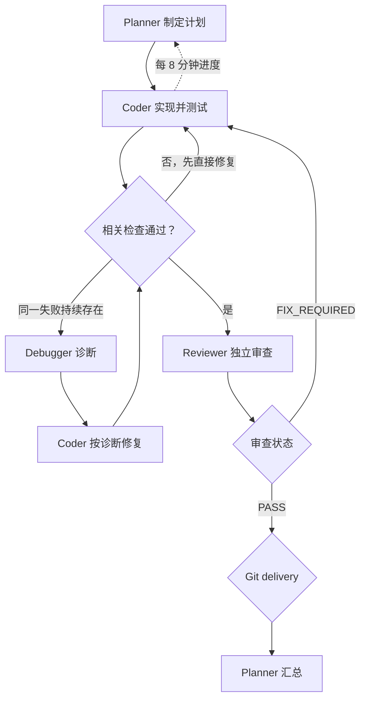

# Herdr Workflow

一个面向 Herdr 共享工作区的顺序式多 Agent 编程工作流。它使用明确的角色分工、文件化 handoff、测试证据和有界修复循环，让规划、实现、调试与审查能够在不同 Agent 之间稳定传递。

该仓库提供的是一个 Codex Skill。核心执行规则位于 [`SKILL.md`](./SKILL.md)。

## 设计目标

这个工作流主要解决以下问题：

- 让一个 Agent 负责总体计划和流程决策；
- 让实现与审查由不同角色完成，减少自我确认；
- 使用共享文件传递目标、诊断和审查结果；
- 以实际 diff、测试命令和输出作为完成证据；
- 只在持续失败时启动 debugger，避免无意义的额外调用；
- 使用 Herdr 的生命周期等待能力，并为 coder 长任务提供每 8 分钟一次的结构化进度；
- 只在最终审查通过后执行经过明确授权的 Git 交付；
- 限制修复循环次数，避免 Agent 在同一问题上无限往返。

工作流不绑定模型或提供商。启动 Agent 时使用哪种 CLI、模型和推理强度，由用户根据任务、额度和可用环境决定。

## 前置条件

开始前需要满足：

1. 当前 Agent 位于 Herdr 管理的 pane 中；
2. 环境变量 `HERDR_ENV` 等于 `1`；
3. 已安装并可使用 `/herdr` skill；
4. 所有参与者位于同一 Herdr workspace，并共享同一个项目目录；
5. 项目中的现有用户修改必须得到保留。

可用以下命令检查运行环境：

```bash
test "${HERDR_ENV:-}" = 1
```

如果检查失败，应从 Herdr 内部启动工作流，而不是从普通终端跨会话控制 Herdr。

## 工作流结构



正常路径是：

```text
planner → coder（每 8 分钟进度）→ reviewer → Git delivery gate → planner
```

debugger 不在正常路径中。它只在满足触发条件时介入：

```text
coder 持续失败 → debugger 诊断 → coder 修复 → reviewer
```

## 角色职责

| 角色 | 主要职责 | 是否修改业务代码 |
|---|---|---:|
| `planner` | 检查仓库、编写计划、分派任务、展示 coder 进度、判断修复或调试分支、执行授权的 Git 交付、汇总结果 | 原则上不修改业务代码 |
| `coder` | 根据计划实现功能、修改测试、运行检查、维护进度文件并报告证据 | 是 |
| `reviewer` | 检查计划、diff、测试证据和行为，输出结构化审查结论 | 否 |
| `debugger` | 对持续失败进行根因诊断，提出最小修复和验证方法 | 否 |

角色必须在 Agent 名称或启动提示中明确指定，不能仅根据模型名称推断职责。

## Handoff 文件

所有协调文件位于项目根目录的 `.herdr/`：

```text
.herdr/
├── PLAN.md
├── PROGRESS.md
├── DEBUG.md
├── REVIEW.md
└── PUBLISH.md
```

`DEBUG.md` 仅在条件式调试被触发时出现；`PUBLISH.md` 仅在 Git 交付成功后出现。

除非用户明确要求，否则不要修改项目的 `.gitignore` 或其他仓库配置来处理这些文件。

### PLAN.md

由 planner 在编码前创建，至少包含：

1. 用户目标；
2. 验收标准；
3. 仓库现状与约束；
4. 预计修改的文件或组件；
5. 实现步骤；
6. 验证步骤；
7. 尚未解决的假设或问题；
8. Git delivery 模式、remote 和目标分支。

coder、debugger 和 reviewer 都应以该文件作为任务范围依据。

### PROGRESS.md

由 coder 在每个工作阶段开始时创建并持续覆盖更新。每条检查点包含：

1. 时间戳；
2. 自上次检查点以来已完成的工作；
3. 当前正在解决的问题；
4. 下一步计划；
5. 阻塞或待决策事项；
6. 最近一条相关命令及结果。

coder 活跃期间，检查点间隔不应超过 8 分钟。长时间前台命令可能推迟更新；下一条检查点必须注明该命令及结果。

### DEBUG.md

由 debugger 创建，至少包含：

1. 失败命令和实际输出；
2. 最小复现方式；
3. 根因假设；
4. 支持该假设的证据；
5. 涉及的文件、符号、接口或假设；
6. 最小修复建议；
7. 用于确认或否定诊断的验证方法。

debugger 只提供诊断，不直接修改源代码或测试。coder 负责实施修复。

### PUBLISH.md

Git 交付成功后由 planner 创建，记录 delivery mode、remote、branch、完整 commit SHA、push 结果、PR 链接以及用于批准交付的测试和 review 状态。

### REVIEW.md

由 reviewer 创建。第一个非空行必须严格为：

```text
PASS
```

或者：

```text
FIX_REQUIRED
```

后续内容应包含：

- 具体发现；
- 严重程度；
- 文件或符号位置；
- 问题为什么会影响正确性；
- 建议的验证方式。

`PASS` 只代表当前请求范围内没有剩余的可执行正确性问题，不代表仓库中所有既有失败都已消失。

## 正常执行流程

### 1. Planner 创建计划

planner 检查：

- `git status`；
- 相关源文件与测试；
- 仓库约束；
- 用户已有但尚未提交的修改。

然后写入 `.herdr/PLAN.md`。

### 2. Coder 实现和验证

planner 使用一次带 `--wait` 的提示提交任务：

```bash
herdr agent prompt coder \
  "Read .herdr/PLAN.md. Implement the requested change and run the relevant checks. Maintain .herdr/PROGRESS.md with a timestamp, completed work, current problem, next action, blockers, and the latest relevant command/result; refresh it at material phase changes and at least every eight minutes while active. Report exact final evidence. Do not dispatch other agents." \
  --wait --timeout 480000
```

coder 必须报告实际执行的命令及结果，不能只声明“已经完成”。

### 3. 每 8 分钟进度

如果 coder 在 480 秒内尚未结束，timeout 只结束当前等待，不会终止 coder。planner 读取一次 `.herdr/PROGRESS.md`，向用户展示：

- 已完成；
- 正在解决；
- 下一步；
- 阻塞。

展示后，planner 在同一编排过程中继续：

```bash
herdr agent wait coder --timeout 480000
```

只要 coder 仍在工作，就重复这一窗口。不要额外立即执行 `agent get`。如果没有新的结构化检查点，planner 必须明确说明，而不能猜测进度；必要时只读取一次可见输出，并要求 coder 在下一个安全边界更新文件。

### 4. Reviewer 独立审查

相关检查通过后，planner 提交 reviewer：

```bash
herdr agent prompt reviewer \
  "Read .herdr/PLAN.md, inspect the current diff and test evidence, and write .herdr/REVIEW.md. Do not modify business code. The first non-empty line must be PASS or FIX_REQUIRED." \
  --wait
```

如果结果为 `FIX_REQUIRED`，planner 将具体发现交回 coder。默认最多执行两轮 fix-review。

## 条件式 Debugger

### 触发条件

满足以下任一条件时可以启动 debugger：

- 同一相关失败在 coder 初次实现和一次针对性修复后仍然存在；
- 失败跨越多个组件，现有证据不足以安全定位根因；
- review 要求的修复导致同一测试持续失败；
- 继续让 coder直接尝试会变成缺少证据的猜测。

普通、明确、可直接修复的错误不应启动 debugger。

### 执行方式

```bash
herdr agent prompt debugger \
  "Read .herdr/PLAN.md, inspect the current diff and failing test evidence, and write .herdr/DEBUG.md with a minimal reproduction, root-cause hypothesis, supporting evidence, affected locations, recommended repair, and verification steps. Diagnose only; do not modify source code or tests." \
  --wait
```

planner 检查 `.herdr/DEBUG.md` 是否提供了可验证的诊断，然后只让 coder 执行一次基于诊断的修复。

默认最多一轮 debugger-diagnosis/fix：

- 修复后检查通过：进入 reviewer；
- 同一失败仍然存在：停止循环并向用户报告诊断和证据。

## 等待与额度优化

Herdr 的 `agent prompt --wait` 会提交提示并等待目标进入 `idle`、`done` 或 `blocked`。reviewer 和 debugger 使用单次等待，不建立轮询循环。coder 为满足用户可见进度要求，单独使用 480 秒检查点窗口。

除 coder 的显式进度协议外：

- 每项任务只提交一次 `agent prompt --wait`；
- 不在提交后立即追加 `agent get`；
- 不执行仅用于确认提交的短 `agent read`；
- 不手动发送 Enter 作为常规兜底；
- 不为了保持 planner 活跃而产生额外轮询；
- 使用 `agent prompt --wait` 返回的生命周期状态；
- 完成后只收集一次必要的语义结果。

coder 的 480 秒 timeout 是计划内的进度检查点，不属于基础设施错误。该功能会增加 planner 和 coder 的模型调用，只应用于 coder。

优先读取 handoff 文件。如果结果只存在于终端 transcript 中，再执行一次大小合适的 `agent read`，不要同时追加冗余状态查询。

### Planner 自动续接

派发任务后，planner 必须保持当前编排回合，直到目标 Agent 进入 settled 状态并处理完下一次 handoff。Herdr 的完成通知可以更新终端或界面状态，但不会自动创建一个新的 planner 模型回合。

- 首选以前台方式执行 `herdr agent prompt <name> ... --wait`；提示已经提交时，改用前台 `herdr agent wait <name>`。
- 不要把 wait 放到 shell 后台、启动后立即结束 planner 回合，或依赖用户再发消息来唤醒流程。
- 如果 planner 所在的执行环境为长命令返回 session/task handle，应使用该环境提供的 wait/resume 能力继续等待同一 handle。不同 CLI 的工具名不同，不能把 `WaitFor` 等私有工具名写成通用要求。
- 宿主等待超时时，只继续等待同一命令或 Agent，不重新提交原任务。
- coder settled 后立即进入 reviewer；reviewer settled 后立即处理 `FIX_REQUIRED` 或 `PASS`，都在同一个 planner 回合中完成。

只有 Agent 确实需要用户输入或授权、用户选择手动节奏，或者宿主无法维持阻塞等待时，planner 才可以提前结束回合。此时必须明确报告等待中的 Agent 和 handoff 阶段。

### 异常恢复

仅在真实异常发生后进行恢复检查：

- `agent_prompt_stalled`；
- timeout；
- `blocked`；
- 缺少预期 handoff 文件；
- 重复的生命周期或提交故障。

`agent_prompt_stalled` 或 timeout 不代表提示一定没有发送。重试前先读取目标一次：

- 如果 Agent 正在工作，使用一次 `agent wait` 等待 settled state；
- 如果任务确实不存在且 Agent 已准备好，最多重新提交一次；
- 不盲目补发 Enter；
- 重复失败时停止并报告现场状态。

## Git 交付

Git 操作位于最终 `PASS` 之后，由 planner 执行，不增加新的 Agent。

在编码前将以下模式之一写入 `.herdr/PLAN.md`：

| 模式 | 行为 |
|---|---|
| `no-push` | 不提交、不推送 |
| `commit-only` | 创建本地 commit，不推送 |
| `push-branch` | 提交并推送任务分支 |
| `push-and-pr` | 推送任务分支并创建 PR |

用户未明确授权时默认 `no-push`。普通的代码修改请求不自动包含远程推送权限。

如果需要推送，应在编码前确认 remote、base 和任务分支。最终 review 为 `PASS` 且全部要求的检查通过后：

1. 检查 `git status --short`、当前分支、remote、暂存区和任务 diff；
2. 排除无关用户修改以及未被要求纳入版本控制的 `.herdr/` 文件；
3. 只暂存本任务文件；
4. 创建清晰 commit，并核对完整 SHA 和提交内容；
5. 将任务分支推送到已确认的 remote，不使用 force；
6. `push-and-pr` 模式下，在 push 成功后创建 PR；
7. 把结果写入 `.herdr/PUBLISH.md`。

存在 `FIX_REQUIRED`、测试失败、未解决的 debugger 诊断、分支或 remote 不明确、无法分离无关修改、缺少授权或需要改写历史时，停止交付并向用户说明。

## 状态与正确性

Herdr 生命周期状态只回答 Agent 是否仍在工作：

| 状态 | 含义 |
|---|---|
| `working` | Agent 正在执行 |
| `blocked` | Agent 等待批准、回答或交互 |
| `idle` / `done` | Agent 已准备接受新输入 |
| `unknown` | Herdr 无法可靠判断状态 |

这些状态不能证明任务在语义上正确。最终完成仍需检查：

- 当前 diff；
- 实际测试命令和输出；
- `.herdr/PLAN.md` 的验收标准；
- `.herdr/REVIEW.md`；
- 条件式调试发生时的 `.herdr/DEBUG.md`。

## 共享工作区安全

- coder、debugger 和 reviewer 顺序执行；
- 只有 coder 修改源代码和测试；
- 不并行修改同一工作树；
- 不重置或丢弃用户已有修改；
- 不关闭或移动不属于本流程的 pane；
- 不添加绕过批准或危险 sandbox 的参数；
- 遇到缺少授权、破坏性操作或关键用户决策时停止；
- 反复出现基础设施故障时停止，不无限重试。

## 完成报告

planner 最终应报告：

- 修改了哪些文件和行为；
- 执行了哪些验证命令；
- 每项验证的实际结果；
- 最终 review 状态；
- debugger 是否被触发及其结论；
- Git delivery 模式、分支、完整 commit SHA、push 结果和 PR 链接；
- 尚未解决的失败；
- 与任务有关的假设或后续工作。

Agent 进入 `idle` 或 `done` 并不等于工作成功。

## 调用示例

在 Herdr 管理的项目工作区内，可以这样提出请求：

```text
Use $herdr-workflow to implement this change through planning, coding,
conditional debugging when needed, and independent review.
```

也可以直接用自然语言要求：

```text
使用 herdr-workflow 完成这个功能。先制定计划，再编码和测试；
只有持续失败时才启用 debugger，最后必须独立 review。
```

## 工作流边界

这个 Skill：

- 不替用户选择模型或提供商；
- 不替代项目自身的 `AGENTS.md`、测试规范或贡献指南；
- 不保证现有测试全部通过；
- 不把 Agent 的自述当作成功证明；
- 不授权推送、部署、删除或其他超出用户请求范围的操作；
- 不在普通单 Agent 请求中自动启动多 Agent 编排。
